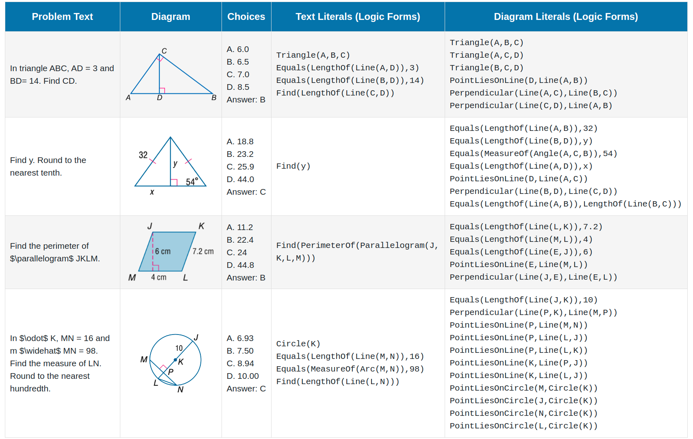
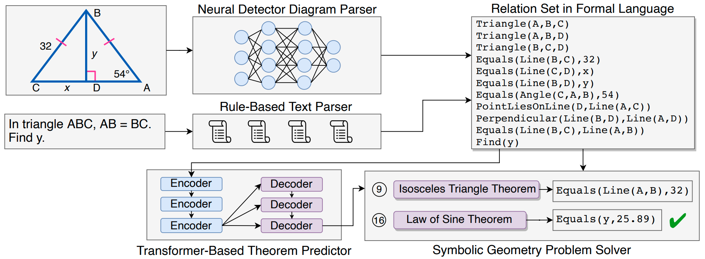
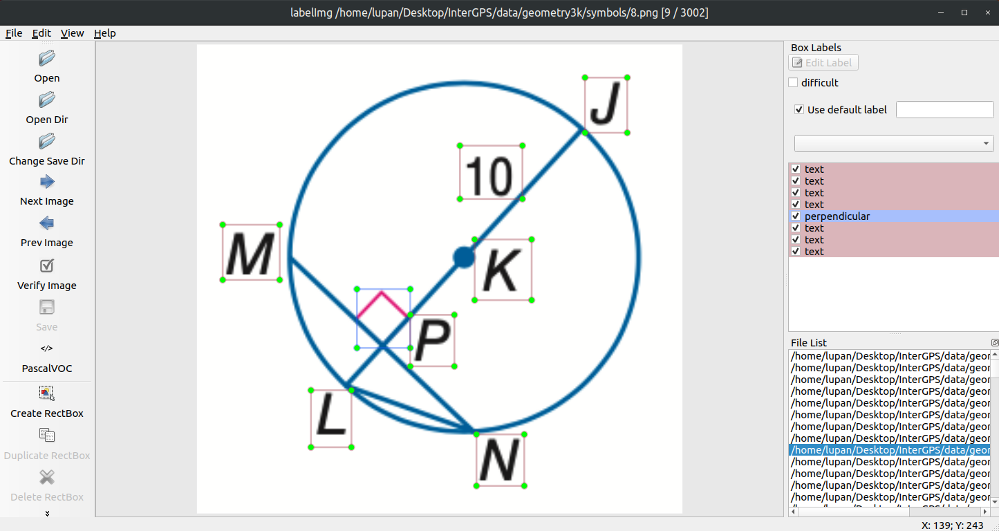

# Introduction

Code and data for ACL 2021 Paper "[Inter-GPS: Interpretable Geometry Problem Solving with Formal Language and Symbolic Reasoning](https://arxiv.org/abs/2105.04165)".

We construct a new large-scale benchmark, **Geometry3K**, which consists of 3,002 geometry problems with dense annotation in formal language. We define 91 predicates and their corresponding literal templates to describe each problem. All predicates are defined in [here](https://github.com/lupantech/InterGPS/blob/main/predicates.md). Four data examples in the *Geometry3K* dataset are shown below:



We further propose a novel geometry solving approach with formal language and symbolic reasoning, called Interpretable Geometry Problem Solver (**Inter-GPS**). Inter-GPS is the first geometry problem solver that achieves automatic program parsing and interpretable  symbolic reasoning. Inter-GPS parses the problem text and diagram into formal language automatically via rule-based text parsing and neural object detecting, respectively. Moreover, Inter-GPS incorporates theorem knowledge as conditional rules and performs symbolic reasoning step by step. 




## Prepare the Dataset

First, unzip data files into `data/geometry3k`:

```shell
. data/unzip_data.sh
```

You can alternatively visit the [Google Drive link](https://drive.google.com/drive/folders/1d05WYXtlgKIoaPpK1v94LYph_heiXM7Z?usp=sharing) to download the Geometry dataset and unzip it.


## Requirements

```text
Python 3.6+
torch 1.7.1
transformers 4.8.2
python3-pip
```

Install all required python dependencies:

```
pip3 install -r requirement.txt
```


## Run Inter-GPS Directly

### The Final Search Strategy

Run the final symbolic solver Inter-GPS without preprocessing data by the following commands:

```shell
cd symbolic_solver
python test.py --label final --strategy final
```

It applies the *final* search strategy (*predict* + *low-first*) with *generated* logic forms from the diagram parser and text parser. The solving result file and logging file will be saved in `pred_results` and `logs`, respectively.

It takes about 5 minutes for the solving process over the 601 test problems with an Intel CPU 10900K with 20 threads. If you don't have a high-performance CPU, please assign a smaller number of threads and larger searching time limit for each problem. For example:

```python
python test.py --label final --strategy final --time_limit 200 --num_threads 4
```

Run the symbolic solver with *annotated* logic forms from the dataset:

```shell
python test.py --label final-gt --strategy final --use_annotated
```

> Note that the results could differ slightly in each individual experiment and on different computing platforms. The differences are mainly resulted from randomness of the search process, dependency versions, CPU features, and running parameters. It is highly recommended to run the solver with multiple times and report the average result of the multiple experiments.

### Other Search Strategies

Also, you can run the solver with other search strategies listed in Table 7 in the paper by running the following commands, receptively:

- *Predict*-based search strategy (*predict* + *random*)  with *annotated* logic forms:

```shell
python test.py --label predict --strategy predict --use_annotated
```

- *Random* search strategy with *annotated* logic forms:

```shell
python test.py --label random --strategy random --use_annotated
```

- *Low-first* search strategy with *annotated* logic forms:

```shell
python test.py --label low-first --strategy low-first --use_annotated
```

All these result files reported in the Table 7 are released in [`symbolic_solver/pred_results`](https://github.com/lupantech/InterGPS/tree/main/symbolic_solver/pred_results) and [`symbolic_solver/logs`](https://github.com/lupantech/InterGPS/tree/main/symbolic_solver/logs), respectively.

### Calculate Accuracies

You can obtain accuracies for different question types by running `python sub_acc.py --result_file {result_json_file} `. For example:

```shell
python sub_acc.py --result_file pred_results/final/logic_1612098244-predict_low-first_1.json
```


## Run Inter-GPS from Scratch

### Text Parser

Parse the problem text into literals (logic forms). 

```shell
cd text_parser
python text_parser.py
```

### Diagram Parser

The diagram parser converts a problem diagram into literals (logic forms). Only the most core running code is shown as following. If you would like to know every detail, please refer to this [README](https://github.com/lupantech/InterGPS/blob/main/diagram_parser/README.md) file.

Unzip our detection results of text regions and symbols:

```shell
cd detection_results
unzip -d box_results box_results.zip
unzip -d ocr_results ocr_results.zip
```

 Generate diagram logic forms by running the following command:

~~~shell
cd parser
python diagram_parser.py \
--data_path ../../data/geometry3k \
--ocr_path ../detection_results/ocr_results \
--box_path ../detection_results/box_results \
--output_path ../diagram_logic_forms.json
~~~


## Theorem Predictor

1. Generate template-based and random-ordered theorem sequences:

```shell
cd theorem_predict/tools
python generate_random_seqs.py
```

It generates two files:

- `results/train/pred_seqs_train_l30_n100_template.json`: 100 template-based sequences with a maximum length of 30 for each training data
- `results/test/pred_seqs_test_l100_random.json`: 1 random-order sequence with a maximum length of 100 for each testing data

2. (Optional) Generate pseudo-optimal theorem sequences for each training data:

```shell
python check_theorem_seq.py
```

It will take about 20 hours to attempt 100 tries over all training data! If you want to save time, just skip this step and use our generated data in [`theorem_predict/results/train/splits`](https://github.com/lupantech/InterGPS/tree/main/theorem_predict/results/train/splits) instead.

3. (Optional) Merge 100 tries of pseudo-optimal theorem sequences into one file. 

```shell
python merge_all_correct_json.py
```

4. (Optional) Train the theorem predictor from scratch:

```shell
python train_transformer.py
```

If you want save time, you could skip the step above and download checkpoint model directly:

```shell
cd theorem_predict
mkdir models
cd models
wget https://acl2021-intergps.s3.us-west-1.amazonaws.com/tp_model_best.pt
```

5. Evaluate the the theorem predictor to generate predicted theorem sequences:

```shell
cd theorem_predict
python eval_transformer.py
```

6. Generate theorem sequences for the *predict*-based strategy (*predict* + *random*):

```shell
cd theorem_predict/tools
python add_random_seq_to_pred_seq.py
```

### Symbolic Solver

Finally, run the symbolic solver with the *Final* search strategy (*predict* + *low-first*) over *generated* logic forms:

```shell
cd symbolic_solver
python test.py --label final_new \
--strategy final \
--text_logic_form_path ../text_parser/text_logic_forms.json \
--diagram_logic_form_path ../diagram_parser/diagram_logic_forms.json \
--predict_path ../theorem_predict/results/test/pred_seqs_test_bart_best.json
```


## Data Annotation Tools

We release the data collection tools that probably help you extend our dataset in the future work.

### Data Collection

The data collection tool is used to collect geometry problems and the corresponding logical forms.

```python
cd annotation_tool/data_collection
python app.py
```


### Symbol Labeling

[LabelImg](https://github.com/tzutalin/labelImg) is a graphical image annotation tool and label object bounding boxes in images. We use this tool to label text regions and symbols in the diagram. If you are using the Linux system, you can just run the following commands to install the tool:

```shell
cd annotation_tool/labelImg
sudo apt-get install pyqt5-dev-tools
sudo pip3 install -r requirements/requirements-linux-python3.txt
make qt5py3
```

Run the labeling tool:

```shell
python labelImg.py
```

After running the tool, click the `Open Dir` button to open the data directory containing problem images, for example, `InterGPS/data/geometry3k/symbols`, and choose `Use default label` to use pre-defined labels in [data/predefined_classes.txt](https://github.com/lupantech/InterGPS/blob/main/annotation_tool/labelImg/data/predefined_classes.txt). Note that pre-defined labels in [data/predefined_classes.txt](https://github.com/lupantech/InterGPS/blob/main/annotation_tool/labelImg/data/predefined_classes.txt) are consistent with labels in [diagram_parser/detection/classes.txt](diagram_parser/detection/classes.txt).



Follow the [instructions](https://github.com/tzutalin/labelImg#labelimg) to install the LabelImg package on other systems or learn more about the usage details.


## Citation

If the paper,  the dataset, or the code helps you, please cite the paper in the following format :

```
@inproceedings{lu2021inter,
  title = {Inter-GPS: Interpretable Geometry Problem Solving with Formal Language and Symbolic Reasoning},
  author = {Lu, Pan and Gong, Ran and Jiang, Shibiao and Qiu, Liang and Huang, Siyuan and Liang, Xiaodan and Zhu, Song-Chun},
  booktitle = {The Joint Conference of the 59th Annual Meeting of the Association for Computational Linguistics and the 11th International Joint Conference on Natural Language Processing (ACL-IJCNLP 2021)},
  year = {2021}
}
```


## Q&A

If you encounter any problem, feel free to either directly contact the first authors or leave an issue in the [github repo](https://github.com/lupantech/InterGPS/issues).

